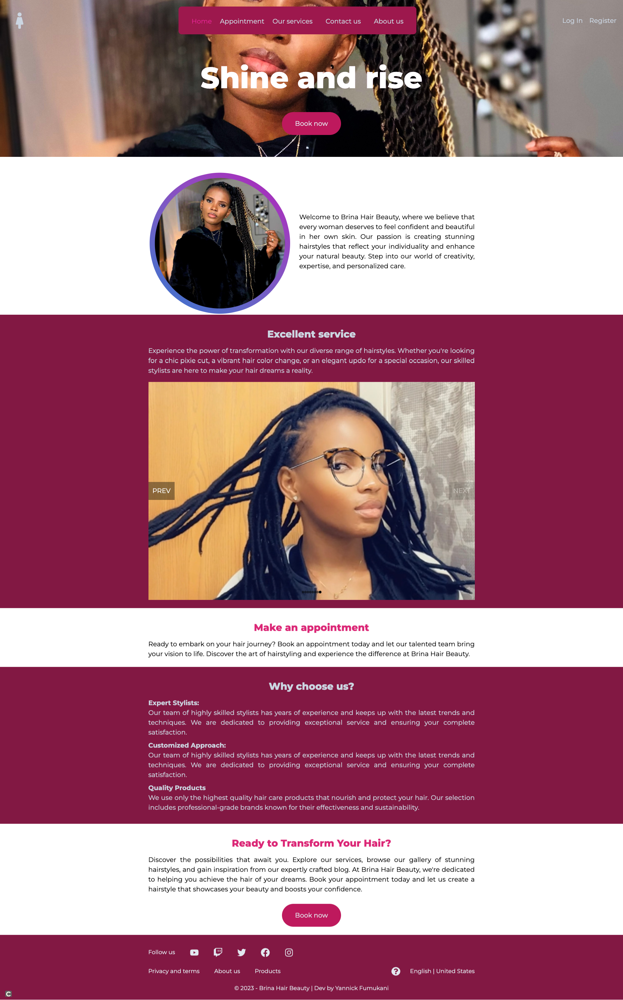

<h1>BHB | Frontend</h1>

This project is the frontend of a full stack application of a saloon

<h2>Technologies used:</h2>

This fronted web app has been utilizing the power of React JS and Vite

<h2>Available commands: </h2>
<ul>
<li>npm run dev : Run the project in dev mode</li>
<li>npm run preview : Preview the project</li>
<li>npm run build : build the production ready version</li>
</ul>

final product url: 
<a href="https://brinahairbeauty.netlify.app" target="_blank">https://brinahairbeauty.netlify.app</a>

<h2>Limitations</h2>

Unauthorized use of this project is prohibited
